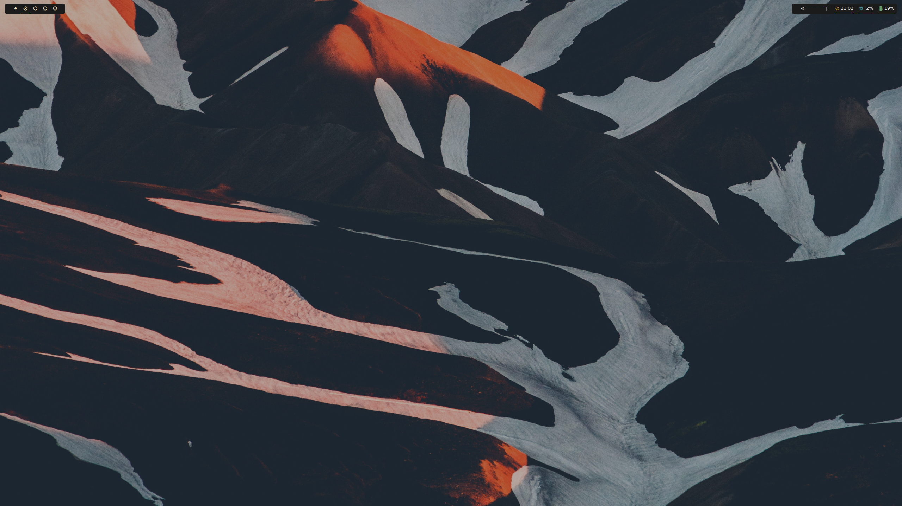
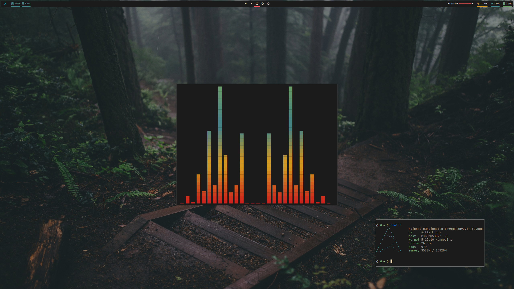

# KJDE
## Kujonello's Desktop Environment (works) [WIP]

KJDE automatic installation for arch based distros
SystemD and OpenRC supported! (for other innit systems you will need to start some services by yourself)

How to install:
1.  Install arch-based distro without GUI (<a href="https://artixlinux.org">Artix Linux </a> is recommended)
2.   Login as your user
3. Install and configure [sudo](https://wiki.archlinux.org/title/Sudo) </a> or [doas](https://wiki.archlinux.org/title/Doas) (doas recommended)
4. Ensure you are connected to the Internet (`ping artixlinux.org`)
5. Install bash and curl packets (`doas pacman -Syu bash wget`)
6. Execute install commands `wget dl.kjde.tk -O kjde-install.sh`, `chmod +x kjde-install.sh`, `bash kjde-install.sh`.
7. Enter password when prompted, wait until it finish
8. Reboot

 
 <b> Preview screenshots </b> 

If something doesn't work dm us on discord:
Kujonello#3793,
uQlel#9256

NOTE: Polybar is bugged, it's AUR's problem ;(
